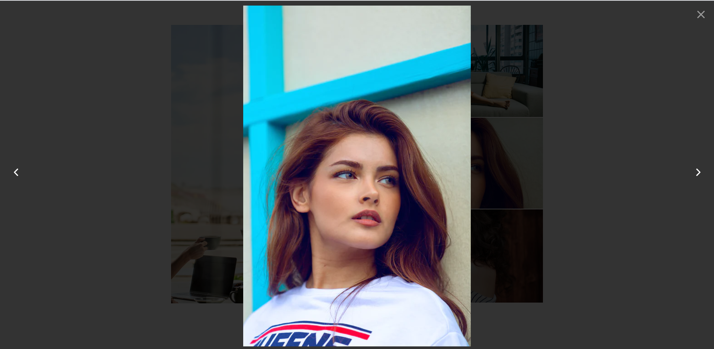

# Photo grid and slideshow component for Vue 3
@chinhpd/vue3-grid-images is a Vue3 component which allows to display images
( 1- 5 ) of your gallery in a grid view as you seen on Facebook timeline.

### How to use
```
npm i @chinhpd/vue3-grid-images
```
```
import { createApp } from 'vue'
import App from './App.vue';
import GiGridImages from '@chinhpd/vue3-grid-images';
const app = createApp(App);

// or any name of component you want
app.component('GiGridImages', GiGridImages);

app.mount('#app')
```

### Images
```vue
<script>
    export default {
        data() {
            return {
                images: [
                    'https://images.unsplash.com/photo-1611095965923-b8b19341cc29?ixid=MnwxMjA3fDF8MHxwaG90by1wYWdlfHx8fGVufDB8fHx8&ixlib=rb-1.2.1&auto=format&fit=crop&w=1051&q=80',
                    'https://images.unsplash.com/photo-1620862657788-a403bdf6dd63?ixid=MnwxMjA3fDB8MHxlZGl0b3JpYWwtZmVlZHwxMnx8fGVufDB8fHx8&ixlib=rb-1.2.1&auto=format&fit=crop&w=500&q=60',
                    'https://images.unsplash.com/photo-1529626455594-4ff0802cfb7e?ixid=MnwxMjA3fDB8MHxzZWFyY2h8NXx8Z2lybHxlbnwwfHwwfHw%3D&ixlib=rb-1.2.1&auto=format&fit=crop&w=500&q=60',
                    'https://images.unsplash.com/photo-1503185912284-5271ff81b9a8?ixid=MnwxMjA3fDB8MHxzZWFyY2h8NHx8Z2lybHxlbnwwfHwwfHw%3D&ixlib=rb-1.2.1&auto=format&fit=crop&w=500&q=60',
                    'https://images.unsplash.com/photo-1593642633279-1796119d5482?ixid=MnwxMjA3fDF8MHxlZGl0b3JpYWwtZmVlZHw2fHx8ZW58MHx8fHw%3D&ixlib=rb-1.2.1&auto=format&fit=crop&w=500&q=60',
                    'https://images.unsplash.com/photo-1611095965923-b8b19341cc29?ixid=MnwxMjA3fDF8MHxwaG90by1wYWdlfHx8fGVufDB8fHx8&ixlib=rb-1.2.1&auto=format&fit=crop&w=1051&q=80',
                    'https://images.unsplash.com/photo-1620862657788-a403bdf6dd63?ixid=MnwxMjA3fDB8MHxlZGl0b3JpYWwtZmVlZHwxMnx8fGVufDB8fHx8&ixlib=rb-1.2.1&auto=format&fit=crop&w=500&q=60',
                    'https://images.unsplash.com/photo-1593642633279-1796119d5482?ixid=MnwxMjA3fDF8MHxlZGl0b3JpYWwtZmVlZHw2fHx8ZW58MHx8fHw%3D&ixlib=rb-1.2.1&auto=format&fit=crop&w=500&q=60'
                ],
            }
        },
    }
</script>
```

### Default config
```vue
<template>
  <div id="app">
    <div class="main-container">
      <grid-images :items="images" />
    </div>
  </div>
</template>

<style scoped>
  #app {
    font-family: -apple-system,BlinkMacSystemFont,"Segoe UI",Roboto,"Helvetica Neue",Arial,"Noto Sans",sans-serif,"Apple Color Emoji","Segoe UI Emoji","Segoe UI Symbol","Noto Color Emoji";
  }
  .main-container {
    width: 800px;
    height: 600px;
    margin: 50px auto;
  }
</style>
```



### Cells config
Cells config will help you to display number of image ( 1- 5 ) in your grid box. The default config is 5 

```vue
  <grid-images :items="images" :cells="4" />
```


```vue
  <grid-images :items="images" :cells="3" />
```


```vue
  <grid-images :items="images" :cells="2" />
```

